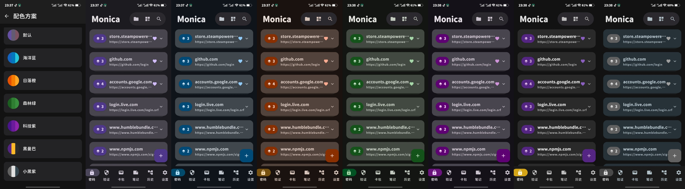
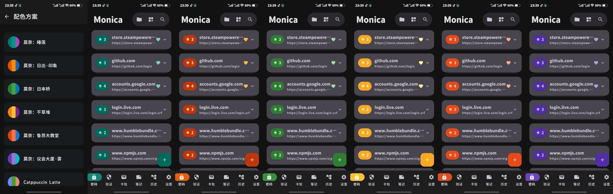
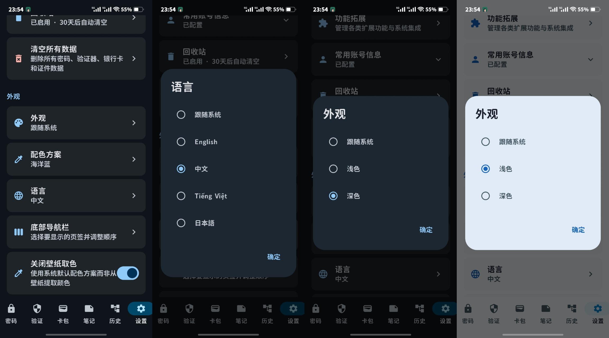
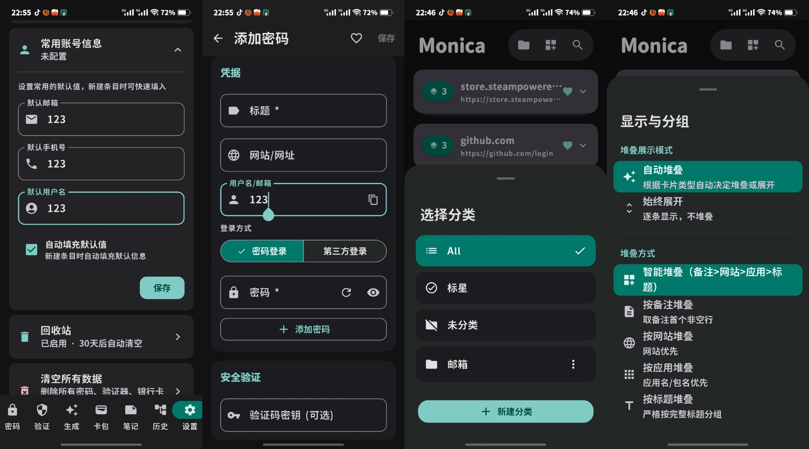
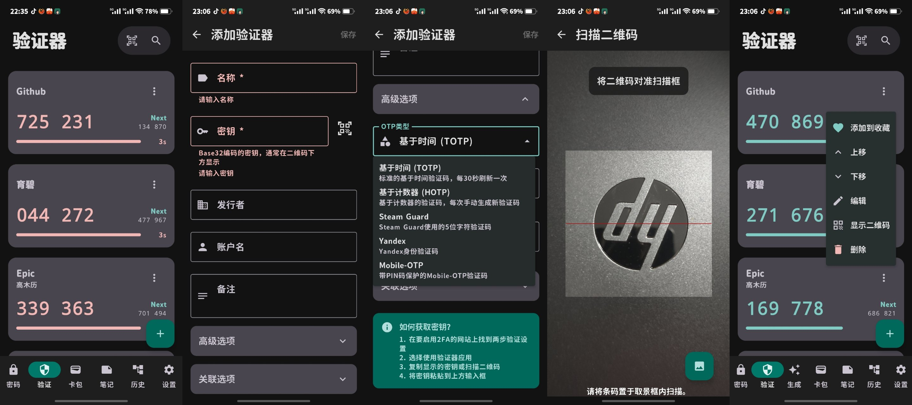
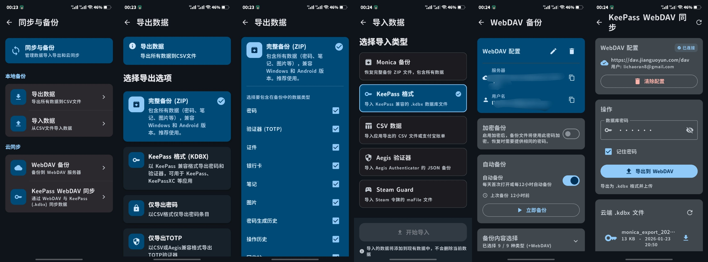
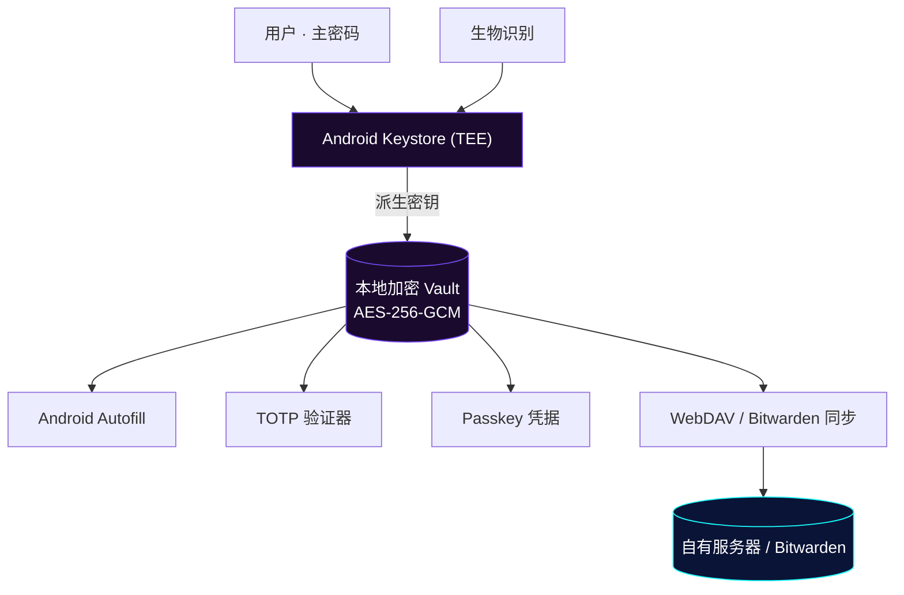

# bastion

<p align="center">
  
</p>

<p align="center">
  <b>本地优先 · 零知识 · 开源</b><br/>
  <sub>Android 密码管理器 · AES-256 · 硬件 Keystore · Bitwarden & KeePass 兼容 · Android 17</sub>
</p>

<p align="center">
  <a href="https://github.com/Chaniug/bastion/releases"></a>
  <a href="https://github.com/Chaniug/bastion/releases"></a>
  <a href="LICENSE"></a>
  <a href="https://github.com/Chaniug/bastion/commits"></a>
</p>

<p align="center">
  <a href="https://github.com/Chaniug/bastion/releases"><b>下载最新 APK</b></a>
  &nbsp;·&nbsp;
  <a href="https://chaniug.github.io/bastion/"><b>项目官网</b></a>
</p>

---

## 目录

- [为什么选择 bastion](#为什么选择-bastion)
- [核心功能](#核心功能)
- [界面预览](#界面预览)
- [安全模型](#安全模型)
- [架构](#架构)
- [与上游 Monica 的差异](#与上游-monica-的差异)
- [路线图](#路线图)
- [快速安装](#快速安装)
- [构建与部署](#构建与部署)
- [常见问题](#常见问题)
- [项目结构](#项目结构)
- [许可](#许可)
- [致谢](#致谢)

---

## 为什么选择 bastion

| 本地优先 · 零信任 | 双生态聚合 | 开源 · 可审计 |
| :--- | :--- | :--- |
| 凭据本地加密，无云依赖；零知识架构，无法找回也无法重置 | 兼容 Bitwarden 同步与 KeePass（`.kdbx`）读写，既有数据一键迁移 | GPLv3 全量开源，CI 构建与发布流程透明 |

> **bastion** 是一款把"你的密码只属于你"落到实处的 Android 密码管理器：数据默认完全离线、密钥由硬件 Keystore 守护、源码全程开源可审计。源自 [Monica](https://github.com/Monica-Pass/Monica) 并独立演进。

## 核心功能

| 功能 | 说明 |
| :--- | :--- |
| **本地 Vault** | 所有凭据 AES-256-GCM 加密存储，数据不托付给第三方云 |
| **双生态聚合** | 兼容 Bitwarden 同步与 KeePass（`.kdbx`）读写 |
| **生物识别解锁** | 系统级指纹 / 面容，兼顾安全与便捷 |
| **TOTP 验证器** | 统一存储并生成 30 秒动态验证码 |
| **Android Autofill** | 系统自动填充服务，覆盖应用与浏览器 |
| **Passkey 支持** | Android 14+ 凭据提供程序 |
| **WebDAV 同步** | 通过自有 WebDAV 基础设施跨设备加密同步 |
| **导入支持** | 一键迁移 KeePass、Bitwarden 等既有数据 |
| **多主题** | 自然 / Material You / 暗色 / 纯黑 / RG 护眼 |
| **Android 17** | targetSdk 37，全面适配最新行为变更 |

## 界面预览

> 多套主题随心切换：自然、Material You、暗色、纯黑、RG 护眼，以及自动填充与 TOTP 验证器界面。

<p align="center">
  
  
  
</p>
<p align="center">
  
  
  
</p>

## 安全模型

- **默认离线**：无需网络权限，数据不出本机
- **AES-256-GCM**：主密码参与密钥派生，本地完成加解密
- **硬件隔离**：密钥封存在 Android Keystore / TEE
- **零知识**：服务端零知识，无法找回、无法重置
- **锁仓清空**：锁定时主动清空内存中的密钥缓存

## 架构



## 与上游 Monica 的差异

bastion 在 [Monica](https://github.com/Monica-Pass/Monica) 基础上独立维护，针对性能、内存、无障碍、自动填充、工程可维护性与 Android 17 适配做了大量工程级优化。

| 方面 | Monica-Pass/Monica | bastion（本分支） |
|------|-------------------|------------------|
| 协程管理 | 散落 `GlobalScope` | 统一 `lifecycleScope`，无泄漏 |
| 密钥操作 | 主线程 Keystore 调用 | 进程级单例 + `prewarm`，移出主线程 |
| Bitwarden 体验 | 1.5s 预热延迟 | 内存预热，即时打开 |
| 自动填充 | 原始实现 | 修复"只填密码不填用户名"，增强小众 App 兼容 |
| Passkey 支持 | 无 | Android 14+ 凭据提供程序 |
| 同步生态 | 单一 | Bitwarden + WebDAV + KeePass 双生态 |
| 构建发布 | 需自行配置签名 | CI 内置签名 + Preview / Stable 自动发布 |
| Android 版本 | targetSdk 35 | targetSdk 37 |
| 视觉品牌 | 原品牌图标 | 玻璃堡垒 + 金色锁孔统一视觉体系 |

## 路线图

- [ ] 更多导入格式支持（Aegis、1Password 等）
- [ ] 跨平台桌面端探索
- [ ] 端到端加密同步方案升级

## 快速安装

1. 从 [Releases](https://github.com/Chaniug/bastion/releases) 下载最新 APK
   - **Stable**：混淆压缩，适合日常使用
   - **Preview**：最新功能尝鲜，可能不够稳定
2. 在 Android 8.0+ 设备安装并初始化主密码
3. （推荐）在系统设置中启用 **bastion 自动填充服务**
4. （可选）配置 WebDAV 同步或导入 KeePass / Bitwarden 数据

### 浏览器扩展

从上游 [Monica](https://github.com/Monica-Pass/Monica) 获取浏览器扩展，与本分支的 Android 端配合使用。

## 构建与部署

```bash
git clone https://github.com/Chaniug/bastion.git
cd bastion/Bastion

# Debug 构建（快速验证）
./gradlew :app:assembleDebug

# Release 构建（混淆压缩）
./gradlew :app:assembleRelease
```

每次推送 `dev` 自动构建 debug APK 并发布到 [Preview Release](https://github.com/Chaniug/bastion/releases/tag/preview)。Stable Release 通过推送 `v*` 标签构建混淆压缩包。

项目官网 [chaniug.github.io/bastion](https://chaniug.github.io/bastion/) 源码位于 `pages/`，改动后自动部署到 GitHub Pages。

## 常见问题

<details>
<summary><b>bastion 和 Monica 是什么关系？</b></summary>

bastion 是在开源 <a href="https://github.com/Monica-Pass/Monica">Monica</a> 基础上独立维护、更名的分支。我们在保持核心能力的同时，对性能、内存、无障碍、自动填充、Android 17 适配等方面做了大量工程级优化。本分支独立演进，不依赖上游发布节奏。
</details>

<details>
<summary><b>我的数据安全吗？开发者能看到吗？</b></summary>

看不到。bastion 默认完全离线运行，所有数据以 AES-256-GCM 加密后仅存储在你的设备上，密钥由硬件 Keystore（TEE）保护。我们不运营任何服务器来接收或中转你的凭据。
</details>

<details>
<summary><b>忘记主密码怎么办？</b></summary>

无法找回。这是零知识架构的核心特性——连我们都无法访问你的数据。请务必妥善保管主密码，建议启用密保问题作为备用恢复方式。
</details>

<details>
<summary><b>如何从其他密码管理器迁移？</b></summary>

支持导入 KeePass（.kdbx）文件和 Bitwarden JSON 导出。也支持通过 Bitwarden API 直接同步自托管或官方 Bitwarden 服务器。
</details>

<details>
<summary><b>如何参与贡献？</b></summary>

欢迎提交 Issue 和 PR。开发分支为 <code>dev</code>，请在 <code>dev</code> 上开发，验证通过后合并到 <code>main</code>。重大改动建议先开 Issue 讨论。
</details>

## 项目结构

```
bastion/
├── Bastion/              # Android 客户端（Kotlin / Compose / Room）
├── BastionDocs/          # VitePress 多语言文档站
├── pages/                # GitHub Pages 静态站点
│   ├── index.html        # 官网首页
│   ├── privacy.html      # 隐私政策
│   ├── terms.html        # 服务条款
│   └── assets/           # style.css / main.js / SVG 图标
├── docs/                 # 技术文档（升级计划、架构分析、开发笔记等）
├── image/                # README 配图与截图
│   └── screenshots/      # 应用界面截图
└── LICENSE
```

## 许可

本项目基于上游 [Monica](https://github.com/Monica-Pass/Monica) 二次开发，继承其 [GNU General Public License v3.0](LICENSE) 开源许可。

## 致谢

感谢 [Monica](https://github.com/Monica-Pass/Monica) 原作者提供的优秀基础，以及以下开源项目的启发与帮助：

- [Bitwarden](https://bitwarden.com/) — 开源密码管理生态、Vault 模型与同步能力
- [KeePass](https://keepass.info/) — 本地密码库理念与 `.kdbx` 生态兼容
