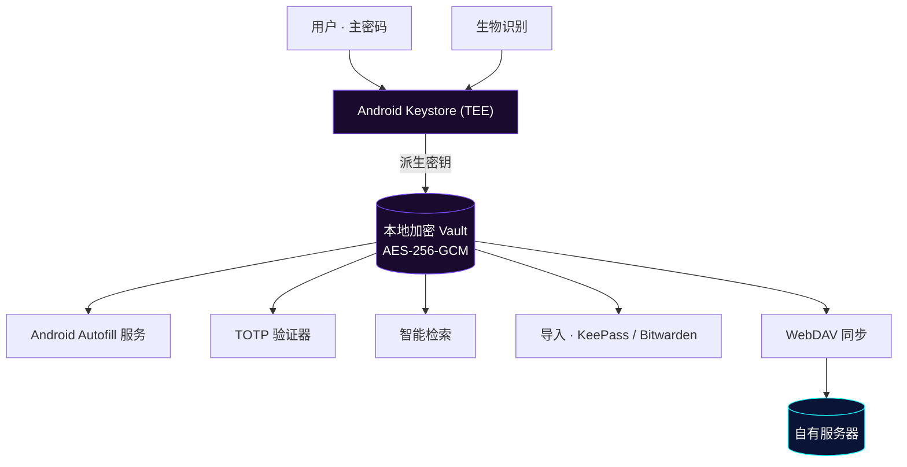
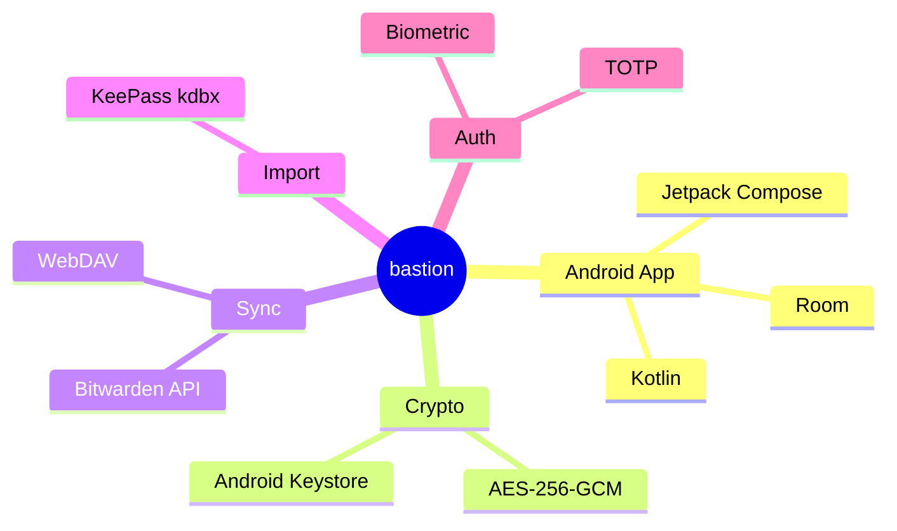

# bastion

<p align="center">
  
</p>

<p align="center">
  <b>本地优先 · 开源 · 安全密码管理</b><br/>
  基于开源 <a href="https://github.com/Monica-Pass/Monica">Monica</a> 代码库二次开发、并更名为 Bastion 的独立分支，持续优化自动填充、主题与同步体验
</p>

<p align="center">
  <a href="https://github.com/Chaniug/bastion/releases"></a>
  <a href="https://github.com/Chaniug/bastion/releases"></a>
  <a href="https://github.com/Chaniug/bastion/commits"></a>
  
  
</p>

---

## ✨ 关于 bastion

**bastion**（本仓库 [Chaniug/bastion](https://github.com/Chaniug/bastion)）是在开源 [Monica](https://github.com/Monica-Pass/Monica) 基础上独立维护、并更名而来的本地优先密码管理器分支。我们在保持上游核心能力的同时，针对**性能、内存、无障碍、自动填充与构建发布**做了大量工程级优化——这不是小幅修补，而是一次偏底层的"大改"。

本分支的开发原则：

- **与上游改动保持大体一致**，不做无意义的重复造轮子
- **在细节部分进一步开发与优化**，修复实际使用中遇到的问题
- **独立维护**，不依赖上游的发布节奏

---

## ⚡ 本分支的优化与改进

相比上游原项目，bastion 在以下方向做了实质性工程投入：

### 🚀 性能与流畅度
- **结构化并发收口**：将散落的 `GlobalScope` 协程统一改为 `ProcessLifecycleOwner.get().lifecycleScope`，绑定进程生命周期、结构化取消，消除后台协程泄漏。
- **密钥操作移出主线程**：`SecurityManager` 改为进程级单例 + `prewarm`，Keystore 重操作从主线程卸载；冷启动时 `MainActivity` 命中缓存近乎零开销。
- **即时查看 Bitwarden 密钥**：去掉 1.5s 预热延迟、改为内存预热，打开即见、无卡顿。

### 🧠 内存与安全
- **有界离线密钥缓存**：Bitwarden 离线密钥缓存改为**有界内存缓存**，并在锁仓（vault lock）时主动清空，降低常驻内存与泄露面。

### ♿ 无障碍体验
- **浏览器 URL 扫描移出主线程**：收敛无障碍浏览器的 URL 扫描触发事件，节点遍历移到后台线程，降低主线程阻塞与电量消耗。
- **进程级初始化守卫**：`Application.onCreate` 按进程守卫，常驻的 `:accessibility` 进程跳过主进程专属的重初始化，降低后台负载。

### 🔎 自动填充
- **修复"只填密码、不填用户名"**：回调重新解析 `AssistStructure` 时不再覆盖构建期烘焙的 `autofillIds`（含合成用户名），改为优先信任 `callbackArgs`。
- **增强兼容性**：修复普通输入框误弹密码的问题，提升对电影猎手等小众 App 的填充适配。

### 🛠️ 构建与发布
- **CI 内置签名 + 自动发布**：推送即产出可安装的 Preview / Release 包，无需自行配置签名密钥。
- **epoch 秒版本号**：`versionCode` 改用 epoch 秒自增，每次构建支持干净覆盖安装（侧载 / OTA 不冲突）。
- **CI 提速**：开启 Gradle 构建缓存与并行、`dev` 跳过 `lint`、合并 test+assemble 为单次调用——冷缓存首跑约 **5.5 分钟**（较早期 ~14.5 分钟提速约 2.5–3 倍）。

### 🎨 视觉与品牌
- **通透图标重设计**：全新玻璃质感、背景透明（跟随壁纸）的盾牌 + 金色锁孔启动图标，提升品牌辨识度。
- **多主题体系**：自然 / Material You 动态取色（Monet）/ 暗色 / 纯黑 / RG 护眼。

---

## 🖼️ 界面预览

> 多套主题随心切换 —— 自然主题、Material You 动态取色（Monet）、暗色、纯黑、RG 护眼，以及自动填充与 TOTP 验证器界面。

<p align="center">
  
  
  
</p>
<p align="center">
  
  
  
</p>

---

## 🚀 核心功能

| 功能 | 说明 |
| :--- | :--- |
| 🔐 **本地 Vault** | 所有凭据本地加密存储，数据不托付给任何第三方云 |
| 🔄 **双生态聚合** | 兼容 Bitwarden 同步能力与 KeePass（`.kdbx`）读写 |
| 🔎 **智能检索** | 按标题、域名、标签毫秒级定位凭据 |
| 👆 **生物识别解锁** | 系统级指纹 / 面容，兼顾安全与便捷 |
| ⏱️ **TOTP 管理** | 统一存储并生成 30 秒动态验证码，临近过期高亮 |
| 📲 **Android Autofill** | 系统自动填充服务，覆盖应用与浏览器账号密码 |
| ☁️ **WebDAV 同步** | 通过自有 WebDAV 基础设施实现跨设备数据流转 |
| 📥 **导入支持** | 一键迁移 KeePass、Bitwarden 等既有数据 |

---

## 🏗️ 架构与数据流向



**技术栈一览**



---

## 📦 快速安装

### Android

1. 从 [Releases](https://github.com/Chaniug/bastion/releases) 下载最新 APK（含 Development Preview）
2. 在 Android 8.0+ 设备安装并初始化主密码
3. （可选）在系统设置中启用 **bastion 自动填充服务**

### 浏览器扩展

从上游 [Monica](https://github.com/Monica-Pass/Monica) 获取浏览器扩展，与本分支的 Android 端配合使用。

---

## 🔐 安全模型

- 所有数据**默认完全离线**，无需任何网络权限
- 数据库采用 **AES-256-GCM** 加密，密钥由 Android Keystore（TEE）保护
- 主密码本地参与密钥派生，**服务端零知识**，无法找回、无法重置
- WebDAV 同步全程加密，仅你与自有服务器可见明文

---

## 🔄 与上游的主要差异（速览）

| 方面 | 上游 (Monica-Pass/Monica) | bastion（本分支） |
|------|---------------------------|---------------------|
| 协程管理 | 散落 `GlobalScope` | 统一 `lifecycleScope`，结构化取消、无泄漏 |
| 密钥操作 | 主线程 Keystore 调用 | 进程级单例 + `prewarm`，移出主线程 |
| Bitwarden 密钥查看 | 1.5s 预热延迟 | 内存预热，即时打开 |
| 离线密钥缓存 | 无界 | 有界缓存，锁仓即清空 |
| 无障碍 URL 扫描 | 主线程遍历 | 事件收敛 + 后台线程遍历 |
| 进程初始化 | 全进程重初始化 | 按进程守卫，`:accessibility` 跳过重初始化 |
| 自动填充 | 原始实现 | 修复"只填密码不填用户名"、增强小众 App 兼容 |
| 版本号策略 | 固定 `versionCode` | epoch 秒自增，干净覆盖安装 |
| 构建与发布 | 需自行配置签名密钥 | CI 内置签名 + Preview / Release 自动发布 |
| CI 构建耗时 | 基线 ~14.5 min | 缓存 + 并行 + 跳过 lint，冷缓存 ~5.5 min |
| 启动图标 | 原品牌图标 | 通透玻璃盾牌 + 金色锁孔（背景透明） |
| 主题体系 | 基础主题 | 自然 / Monet / 暗色 / 纯黑 / RG 护眼 |

---

## 🗺️ 路线图

- [x] 自动填充兼容性增强（小众 App / 普通输入框误弹 / 用户名回填修复）
- [x] 多主题体系（自然 / Monet / 暗色 / 纯黑 / RG）
- [x] CI 内置签名与 Preview Release 自动发布 + 构建提速（~14.5min → ~5.5min）
- [x] 性能与内存工程（结构化并发、Keystore 移出主线程、有界离线密钥缓存）
- [x] 无障碍优化（URL 扫描移出主线程、进程级初始化守卫）
- [x] 通透玻璃图标重设计
- [ ] 更多导入格式支持
- [ ] 跨平台桌面端探索
- [ ] 端到端加密同步方案升级

---

## 🛠️ 构建

```bash
# 克隆
git clone https://github.com/Chaniug/bastion.git

# 进入 Android 目录
cd bastion/Bastion

# 构建
./gradlew :app:assembleRelease
```

GitHub Actions 在每次推送 `main` 分支时自动构建并发布 Development Preview，可在 [Releases](https://github.com/Chaniug/bastion/releases) 页面下载。

### 静态官网（项目 Pages）

项目主页 `chaniug.github.io/bastion/` 的源码位于 `pages/`，是一套零构建的静态站点（HTML + CSS + 内联 SVG，与 App 图标同源：玻璃盾牌 + 金色锁孔）。

```bash
# 本地预览（需 Python）
cd pages && python3 -m http.server 4173
```

部署通过 GitHub Actions 自动完成：仅当 `pages/` 目录内容变动时触发 `.github/workflows/deploy-pages.yml`，将 `pages/` 发布到 Pages（普通 app 推送不再重部署官网）。也可在 Actions 页手动 `Run workflow` 触发一次性部署。

> ⚠️ 首次生效需在仓库 **Settings → Pages → Source** 选择 **"GitHub Actions"**（旧的手工分支部署已失效）。

> 旧的历史 Vite 文档站 `documentation/website`（带 Monica 旧品牌）已从仓库移除，相关截图已迁至 `image/screenshots/`。

---

## 📂 项目结构

```
bastion/
├── Bastion/   # Android 客户端（Kotlin / Compose）
├── pages/     # 项目 Pages 静态站点（GitHub Pages 源）
│   ├── index.html
│   ├── privacy.html / terms.html
│   └── assets/   # style.css / main.js / shield.svg / lock.svg
├── image/                # README 配图与图标（含 screenshots/）
└── LICENSE
```

---

## 📄 许可

本项目基于上游 [Monica](https://github.com/Monica-Pass/Monica) 二次开发，继承其 [GNU General Public License v3.0](LICENSE) 开源许可。

---

## 🙏 致谢

感谢 [Monica](https://github.com/Monica-Pass/Monica) 原作者提供的优秀基础，以及以下开源项目的启发与帮助：

- [Bitwarden](https://bitwarden.com/) — 开源密码管理生态、Vault 模型与同步能力
- [KeePass](https://keepass.info/) — 本地密码库理念与 `.kdbx` 生态兼容
