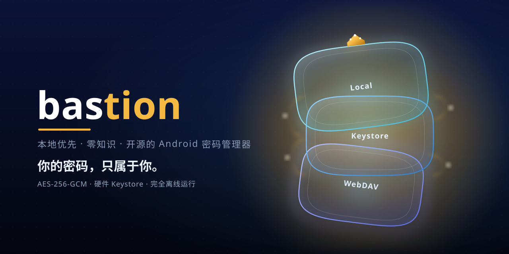
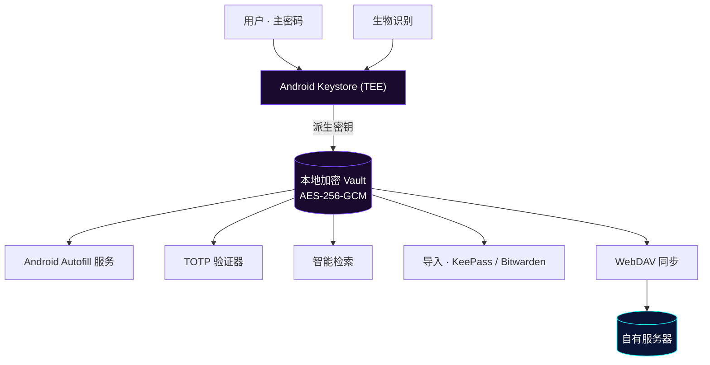
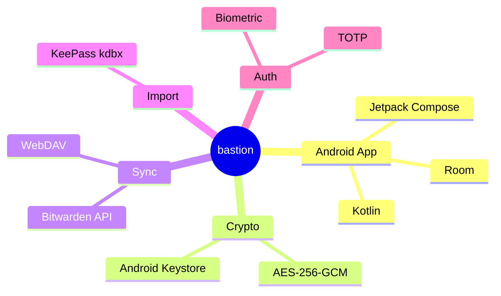

# bastion

<p align="center">
  
</p>

<p align="center">
  <b>本地优先 · 开源 · 安全密码管理</b><br/>
  基于开源 <a href="https://github.com/Monica-Pass/Monica">Monica</a> 代码库二次开发、并更名为 Bastion 的独立分支，持续优化自动填充、主题与同步体验
</p>

<p align="center">
  <a href="https://github.com/Chaniug/bastion/releases"></a>
  <a href="https://github.com/Chaniug/bastion/releases"></a>
  <a href="https://github.com/Chaniug/bastion/commits"></a>
  
  
</p>

---

## ✨ 关于 bastion

**bastion**（本仓库 [Chaniug/bastion](https://github.com/Chaniug/bastion)）是在开源 [Monica](https://github.com/Monica-Pass/Monica) 基础上独立维护、并更名而来的本地优先密码管理器分支，在保持上游核心能力的基础上进行针对性优化与功能增强。

本分支的开发原则：

- **与上游改动保持大体一致**，不做无意义的重复造轮子
- **在细节部分进一步开发与优化**，修复实际使用中遇到的问题
- **独立维护**，不依赖上游的发布节奏

---

## 🖼️ 界面预览

> 多套主题随心切换 —— 自然主题、Material You 动态取色（Monet）、暗色、纯黑、RG 护眼，以及自动填充与 TOTP 验证器界面。

<p align="center">
  
  
  
</p>
<p align="center">
  
  
  
</p>

---

## 🚀 核心功能

| 功能 | 说明 |
| :--- | :--- |
| 🔐 **本地 Vault** | 所有凭据本地加密存储，数据不托付给任何第三方云 |
| 🔄 **双生态聚合** | 兼容 Bitwarden 同步能力与 KeePass（`.kdbx`）读写 |
| 🔎 **智能检索** | 按标题、域名、标签毫秒级定位凭据 |
| 👆 **生物识别解锁** | 系统级指纹 / 面容，兼顾安全与便捷 |
| ⏱️ **TOTP 管理** | 统一存储并生成 30 秒动态验证码，临近过期高亮 |
| 📲 **Android Autofill** | 系统自动填充服务，覆盖应用与浏览器账号密码 |
| ☁️ **WebDAV 同步** | 通过自有 WebDAV 基础设施实现跨设备数据流转 |
| 📥 **导入支持** | 一键迁移 KeePass、Bitwarden 等既有数据 |

---

## 🏗️ 架构与数据流向



**技术栈一览**



---

## 📦 快速安装

### Android

1. 从 [Releases](https://github.com/Chaniug/bastion/releases) 下载最新 APK（含 Development Preview）
2. 在 Android 8.0+ 设备安装并初始化主密码
3. （可选）在系统设置中启用 **bastion 自动填充服务**

### 浏览器扩展

从上游 [Monica](https://github.com/Monica-Pass/Monica) 获取浏览器扩展，与本分支的 Android 端配合使用。

---

## 🔐 安全模型

- 所有数据**默认完全离线**，无需任何网络权限
- 数据库采用 **AES-256-GCM** 加密，密钥由 Android Keystore（TEE）保护
- 主密码本地参与密钥派生，**服务端零知识**，无法找回、无法重置
- WebDAV 同步全程加密，仅你与自有服务器可见明文

---

## 🔄 与上游的主要差异

| 方面 | 上游 (Monica-Pass/Monica) | bastion（本分支） |
|------|---------------------------|---------------------|
| 自动填充 | 原始实现 | 增强兼容（电影猎手等小众 App），修复普通输入框误弹密码 |
| 版本号策略 | 固定 versionCode | epoch 秒自增，每次构建支持覆盖安装 |
| 构建方式 | 需自行配置签名密钥 | CI 内置签名 + Preview Release 自动发布 |
| 更新频率 | 按上游节奏 | 持续迭代，独立发布 |

---

## 🗺️ 路线图

- [x] 自动填充兼容性增强（小众 App / 普通输入框误弹修复）
- [x] 多主题体系（自然 / Monet / 暗色 / 纯黑 / RG）
- [x] CI 内置签名与 Preview Release 自动发布
- [ ] 更多导入格式支持
- [ ] 跨平台桌面端探索
- [ ] 端到端加密同步方案升级

---

## 🛠️ 构建

```bash
# 克隆
git clone https://github.com/Chaniug/bastion.git

# 进入 Android 目录
cd bastion/Bastion

# 构建
./gradlew :app:assembleRelease
```

GitHub Actions 在每次推送 `main` 分支时自动构建并发布 Development Preview，可在 [Releases](https://github.com/Chaniug/bastion/releases) 页面下载。

### 静态官网（本项目文档站）

```bash
cd documentation/website
npm install
npm run build      # 输出至 dist/，部署到 GitHub Pages
```

> 站点 `base` 已配置为 `/bastion/`，可直接作为 `chaniug.github.io/bastion` 的 Project Pages 发布。

---

## 📂 项目结构

```
bastion/
├── Bastion/   # Android 客户端（Kotlin / Compose）
├── documentation/
│   └── website/          # 静态官网（Vite + GitHub Pages）
│       ├── src/          # 站点源码（HTML / JS / CSS）
│       ├── public/       # 静态资源与截图
│       └── dist/         # 构建产物
├── image/                # README 配图与图标
└── LICENSE
```

---

## 📄 许可

本项目基于上游 [Monica](https://github.com/Monica-Pass/Monica) 二次开发，继承其 [GNU General Public License v3.0](LICENSE) 开源许可。

---

## 🙏 致谢

感谢 [Monica](https://github.com/Monica-Pass/Monica) 原作者提供的优秀基础，以及以下开源项目的启发与帮助：

- [Bitwarden](https://bitwarden.com/) — 开源密码管理生态、Vault 模型与同步能力
- [KeePass](https://keepass.info/) — 本地密码库理念与 `.kdbx` 生态兼容
