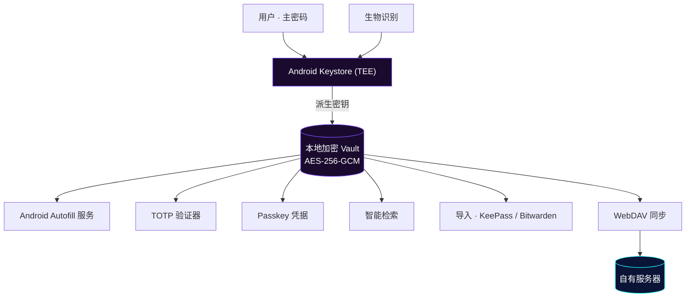
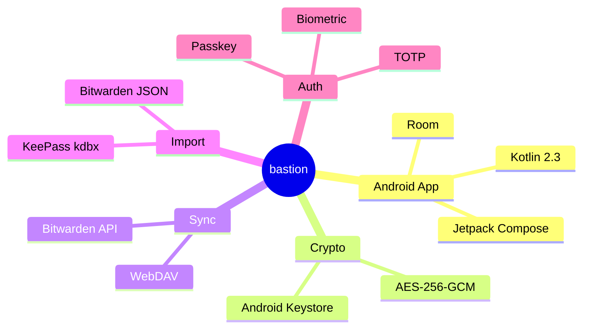

# bastion

<p align="center">
  
</p>

<p align="center">
  <b>本地优先 · 开源 · 你的堡垒</b><br/>
  <sub>Android 密码管理器 | AES-256 加密 | 硬件 Keystore | 零知识架构 | 适配 Android 17</sub>
</p>

<p align="center">
  <a href="https://github.com/Chaniug/bastion/releases"></a>
  <a href="https://github.com/Chaniug/bastion/releases"></a>
  <a href="https://github.com/Chaniug/bastion/releases"></a>
  <a href="https://github.com/Chaniug/bastion/commits"></a>
</p>

<p align="center">
  
  
  
  
</p>

<p align="center">
  <a href="https://github.com/Chaniug/bastion/releases"><b>📥 下载最新 APK</b></a>
  &nbsp;·&nbsp;
  <a href="https://chaniug.github.io/bastion/"><b>🌐 项目官网</b></a>
</p>

---

## 📖 目录

- [🌟 为什么选择 bastion](#-为什么选择-bastion)
- [🚀 核心功能](#-核心功能)
- [🖼️ 界面预览](#️-界面预览)
- [⚡ 相比上游的优化与改进](#-相比上游的优化与改进)
- [🏗️ 架构与数据流向](#️-架构与数据流向)
- [📦 快速安装](#-快速安装)
- [🔐 安全模型](#-安全模型)
- [🔄 与上游的主要差异](#-与上游的主要差异)
- [🗺️ 路线图](#️-路线图)
- [🛠️ 构建与部署](#️-构建与部署)
- [❓ FAQ](#-faq)
- [📂 项目结构](#-项目结构)
- [📄 许可](#-许可)
- [🙏 致谢](#-致谢)

---

## 🌟 为什么选择 bastion

| 🔒 本地优先 · 零信任 | 🔄 双生态聚合 | 🛡️ 开源 · 可审计 |
| :--- | :--- | :--- |
| 凭据本地加密，无云依赖；服务端零知识，无法找回也无法重置 | 兼容 Bitwarden 同步与 KeePass（`.kdbx`）读写，既有数据一键迁移无压力 | GPLv3 全量开源，CI 构建与发布流程透明，欢迎审阅与共建 |

> **bastion 是什么？** 一个把"你的密码只属于你"落到实处的 Android 密码管理器：数据默认完全离线、密钥由硬件 Keystore 守护、源码全程开源可审计。源自 [Monica](https://github.com/Monica-Pass/Monica) 并独立演进。

---

## 🚀 核心功能

| 功能 | 说明 |
| :--- | :--- |
| 🔐 **本地 Vault** | 所有凭据本地 AES-256-GCM 加密存储，数据不托付给任何第三方云 |
| 🔄 **双生态聚合** | 兼容 Bitwarden 同步与 KeePass（`.kdbx`）读写，数据迁移无障碍 |
| 👆 **生物识别解锁** | 系统级指纹 / 面容，兼顾安全与便捷 |
| ⏱️ **TOTP 验证器** | 统一存储并生成 30 秒动态验证码，临近过期高亮提醒 |
| 📲 **Android Autofill** | 系统自动填充服务，覆盖应用与浏览器账号密码 |
| 🔑 **Passkey 支持** | Android 14+ 凭据提供程序，无密码登录 |
| ☁️ **WebDAV 同步** | 通过自有 WebDAV 基础设施实现跨设备加密同步 |
| 📥 **导入支持** | 一键迁移 KeePass、Bitwarden 等既有数据 |
| 🎨 **5 套主题** | 自然 / Material You (Monet) / 暗色 / 纯黑 / RG 护眼 |
| 🤖 **Android 17 适配** | targetSdk 37，全面适配最新 Android 行为变更 |

---

## 🖼️ 界面预览

> 多套主题随心切换 —— 自然主题、Material You 动态取色（Monet）、暗色、纯黑、RG 护眼，以及自动填充与 TOTP 验证器界面。

<p align="center">
  
  
  
</p>
<p align="center">
  
  
  
</p>

---

## ⚡ 相比上游的优化与改进

bastion 在 [Monica](https://github.com/Monica-Pass/Monica) 基础上独立维护，针对**性能、内存、无障碍、自动填充、工程可维护性与 Android 17 适配**做了大量工程级优化。

### 🚀 性能与流畅度
- **结构化并发收口**：散落的 `GlobalScope` 协程统一改为 `ProcessLifecycleOwner.get().lifecycleScope`，消除后台协程泄漏。
- **密钥操作移出主线程**：`SecurityManager` 改为进程级单例 + `prewarm`，Keystore 重操作从主线程卸载。
- **即时查看 Bitwarden 密钥**：去掉 1.5s 预热延迟、改为内存预热，打开即见。

### 🧠 内存与安全
- **有界离线密钥缓存**：Bitwarden 离线密钥缓存改为有界内存缓存，锁仓时主动清空，降低泄露面。

### ♿ 无障碍体验
- **URL 扫描移出主线程**：收敛无障碍浏览器的 URL 扫描事件，节点遍历移到后台线程。
- **进程级初始化守卫**：`:accessibility` 进程跳过主进程专属的重初始化，降低后台负载。

### 🔎 自动填充
- **修复"只填密码、不填用户名"**：优先信任 `callbackArgs`，不再覆盖合成用户名。
- **Passkey 凭据提供程序**：Android 14+ 原生无密码登录支持。
- **增强兼容性**：修复普通输入框误弹密码，提升小众 App 填充适配。

### 🧱 工程可维护性
- **PasswordViewModel 瘦身 690 行**（4162 → 3472）：拆分为 8 个协调器/工具类。
- **行为测试网 583 条零失败**：mockk 补齐删除/归档/迁移/主密码/历史等此前零覆盖的路径。
- **主页面滚动流畅性**：TOTP 验证码从 50ms 平滑刷新降为秒级刷新。

### 🛠️ 构建与工具链
- **Android 17 适配**：targetSdk 37 + AGP 9.1.1 + Gradle 9.3.1 + Kotlin 2.3.21。
- **CI 内置签名 + 自动发布**：推送即产出可安装的 Preview / Stable 包。
- **epoch 秒版本号**：`versionCode` 自增，干净覆盖安装无冲突。

### 🎨 视觉与品牌
- **玻璃质感启动图标重设计**：玻璃盾牌 + 金色锁孔启动图标，背景与启动色同色融合（消除 SplashScreen 黑色圆环，桌面图标与启动屏视觉统一）。
- **多主题体系**：自然 / Monet / 暗色 / 纯黑 / RG 护眼。

---

## 🏗️ 架构与数据流向



**技术栈**



---

## 📦 快速安装

### Android

1. 从 [Releases](https://github.com/Chaniug/bastion/releases) 下载最新 APK
   - **Stable**：混淆压缩、适合日常使用
   - **Preview**：最新功能尝鲜、可能不够稳定
2. 在 Android 8.0+ 设备安装并初始化主密码
3. （推荐）在系统设置中启用 **bastion 自动填充服务**
4. （可选）配置 WebDAV 同步或导入 KeePass / Bitwarden 数据

### 浏览器扩展

从上游 [Monica](https://github.com/Monica-Pass/Monica) 获取浏览器扩展，与本分支的 Android 端配合使用。

---

## 🔐 安全模型

- 所有数据**默认完全离线**，无需任何网络权限
- 数据库采用 **AES-256-GCM** 加密，密钥由 Android Keystore（TEE）保护
- 主密码本地参与密钥派生，**服务端零知识**，无法找回、无法重置
- WebDAV 同步全程加密，仅你与自有服务器可见明文
- 锁仓时主动清空内存中的密钥缓存，降低泄露面

---

## 🔄 与上游的主要差异

| 方面 | 上游 (Monica-Pass/Monica) | bastion（本分支） |
|------|---------------------------|---------------------|
| 协程管理 | 散落 `GlobalScope` | 统一 `lifecycleScope`，结构化取消、无泄漏 |
| 密钥操作 | 主线程 Keystore 调用 | 进程级单例 + `prewarm`，移出主线程 |
| Bitwarden 密钥查看 | 1.5s 预热延迟 | 内存预热，即时打开 |
| 离线密钥缓存 | 无界 | 有界缓存，锁仓即清空 |
| 无障碍 URL 扫描 | 主线程遍历 | 事件收敛 + 后台线程遍历 |
| 进程初始化 | 全进程重初始化 | 按进程守卫，`:accessibility` 跳过重初始化 |
| 自动填充 | 原始实现 | 修复"只填密码不填用户名"、增强小众 App 兼容 |
| Passkey 支持 | 无 | Android 14+ 凭据提供程序 |
| 版本号策略 | 固定 `versionCode` | epoch 秒自增，干净覆盖安装 |
| 构建与发布 | 需自行配置签名密钥 | CI 内置签名 + Preview / Stable 自动发布 |
| Android 17 | targetSdk 35 | targetSdk 37（AGP 9.1.1 + Kotlin 2.3.21） |
| 启动图标 | 原品牌图标 | 玻璃盾牌 + 金色锁孔（背景与启动色融合，修复 SplashScreen 黑色圆环） |
| 主题体系 | 基础主题 | 自然 / Monet / 暗色 / 纯黑 / RG 护眼 |
| 工程测试 | 少量测试 | 583 条行为测试零失败 + CI 回归基线闸门 |

---

## 🗺️ 路线图

- [x] 自动填充兼容性增强（小众 App / 用户名回填修复）
- [x] 多主题体系（自然 / Monet / 暗色 / 纯黑 / RG）
- [x] CI 内置签名与 Preview / Stable 自动发布 + 构建提速
- [x] 性能与内存工程（结构化并发、Keystore 移出主线程、有界缓存）
- [x] 无障碍优化（URL 扫描移出主线程、进程级初始化守卫）
- [x] 玻璃质感启动图标重设计（与启动色融合，修复 SplashScreen 黑色圆环）
- [x] 主页面滚动流畅性（TOTP 降频）
- [x] PasswordViewModel 拆分重构（4162 → 3472 行，8 个协调器）
- [x] 行为测试网（583 条零失败 + CI 基线闸门）
- [x] Android 17 适配（targetSdk 37 + 行为变更适配 + 网络安全配置）
- [x] Passkey 凭据提供程序（Android 14+ 无密码登录）
- [ ] 更多导入格式支持（Aegis、1Password 等）
- [ ] 跨平台桌面端探索
- [ ] 端到端加密同步方案升级

---

## 🛠️ 构建与部署

```bash
# 克隆
git clone https://github.com/Chaniug/bastion.git

# 进入 Android 目录
cd bastion/Bastion

# Debug 构建（快速验证）
./gradlew :app:assembleDebug

# Release 构建（混淆压缩）
./gradlew :app:assembleRelease
```

**CI/CD**：每次推送 `dev`/`main` 自动构建 debug APK 并发布到 [Preview Release](https://github.com/Chaniug/bastion/releases/tag/preview)。Stable Release 通过手动触发或推送 `v*` 标签构建混淆压缩包。

### 项目官网

项目官网 [chaniug.github.io/bastion](https://chaniug.github.io/bastion/) 源码位于 `pages/`，是一套零构建静态站点。

```bash
# 本地预览
cd pages && python3 -m http.server 4173
```

部署由 `.github/workflows/deploy-pages.yml` 自动完成：`pages/` 目录变动时自动发布到 GitHub Pages。

> ⚠️ 首次生效需在仓库 **Settings → Pages → Source** 选择 **"GitHub Actions"**。

---

## ❓ FAQ

<details>
<summary><b>bastion 和 Monica 是什么关系？</b></summary>
bastion 是在开源 <a href="https://github.com/Monica-Pass/Monica">Monica</a> 基础上独立维护、更名的分支。我们在保持核心能力的同时，对性能、内存、无障碍、自动填充、Android 17 适配等方面做了大量工程级优化。本分支独立演进，不依赖上游发布节奏。
</details>

<details>
<summary><b>我的数据安全吗？开发者能看到吗？</b></summary>
看不到。bastion 默认完全离线运行，所有数据以 AES-256-GCM 加密后仅存储在你的设备上，密钥由硬件 Keystore（TEE）保护。我们不运营任何服务器来接收或中转你的凭据。
</details>

<details>
<summary><b>忘记主密码怎么办？</b></summary>
无法找回。这是零知识架构的核心特性——连我们都无法访问你的数据。请务必妥善保管主密码，建议启用密保问题作为备用恢复方式。
</details>

<details>
<summary><b>如何从其他密码管理器迁移？</b></summary>
支持导入 KeePass（.kdbx）文件和 Bitwarden JSON 导出。也支持通过 Bitwarden API 直接同步自托管或官方 Bitwarden 服务器。
</details>

<details>
<summary><b>如何参与贡献？</b></summary>
欢迎提交 Issue 和 PR。开发分支为 <code>dev</code>，请在 <code>dev</code> 上开发，验证通过后合并到 <code>main</code>。重大改动建议先开 Issue 讨论。
</details>

---

## 📂 项目结构

```
bastion/
├── Bastion/              # Android 客户端（Kotlin / Compose / Room）
├── BastionDocs/          # VitePress 多语言文档站
├── pages/                # GitHub Pages 静态站点
│   ├── index.html        # 官网首页
│   ├── privacy.html      # 隐私政策
│   ├── terms.html        # 服务条款
│   └── assets/           # style.css / main.js / SVG 图标
├── docs/                # 技术文档（升级计划、架构分析、开发笔记等）
├── image/                # README 配图与截图
│   └── screenshots/      # 应用界面截图
└── LICENSE
```

---

## 📄 许可

本项目基于上游 [Monica](https://github.com/Monica-Pass/Monica) 二次开发，继承其 [GNU General Public License v3.0](LICENSE) 开源许可。

---

## 🙏 致谢

感谢 [Monica](https://github.com/Monica-Pass/Monica) 原作者提供的优秀基础，以及以下开源项目的启发与帮助：

- [Bitwarden](https://bitwarden.com/) — 开源密码管理生态、Vault 模型与同步能力
- [KeePass](https://keepass.info/) — 本地密码库理念与 `.kdbx` 生态兼容
